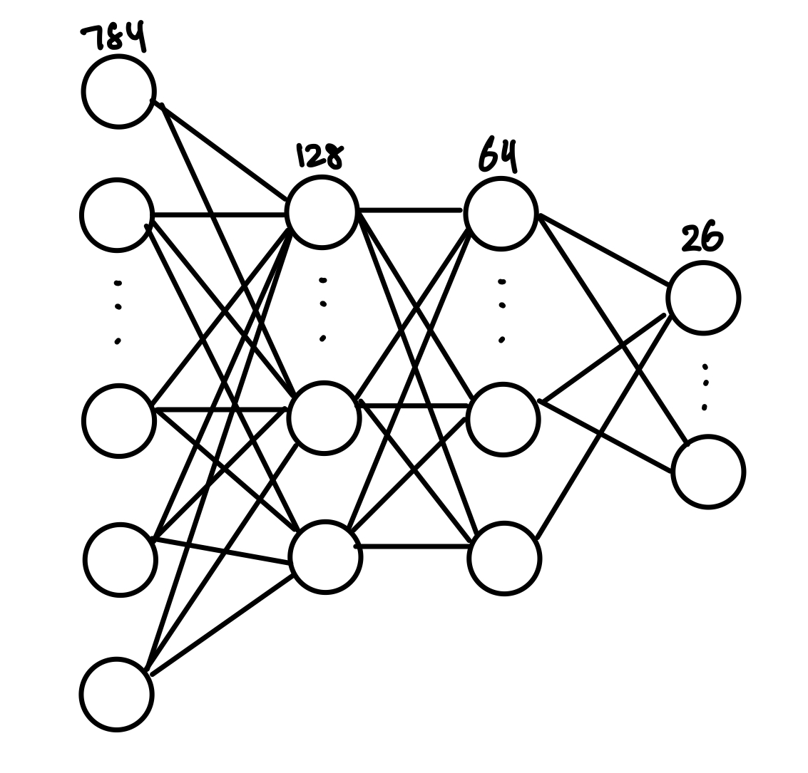
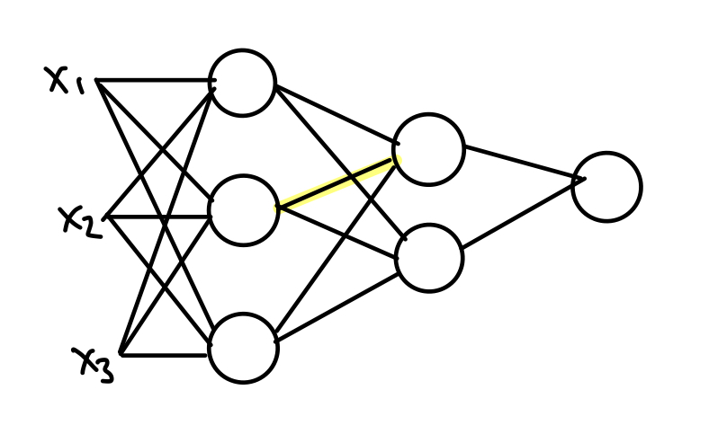
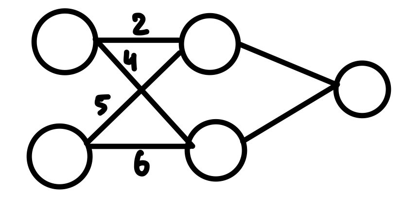
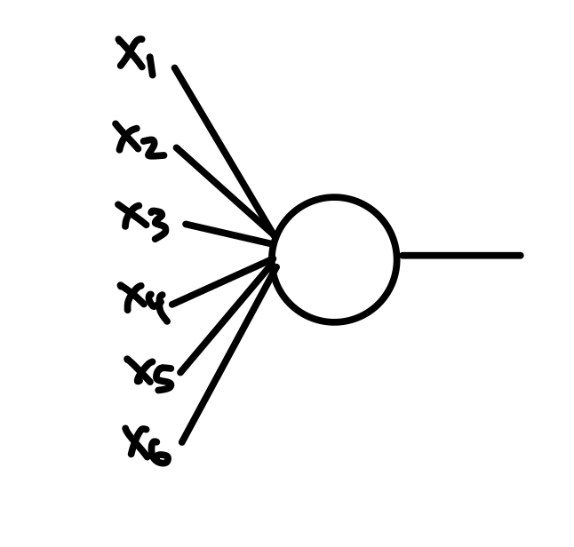

# Neural Network for Braille

# Foreword
This GitHub repository is home to my project of building a neural network from scratch, using no libraries except NumPy to perform rudimentary mathematical operations. In this document, I will provide a mathematical introduction to neural networks, as well as documenting my steps along the way. I made this project to gain a better understanding into the theoretical side of Machine Learning and Neural Networks, and have learned many things along the way, and I hope you will also learn something new from this exploration too! 

<!-- Add in who this is for -->

## Introduction 

Multilayer Perceptions (MLP's) is a simple form of Neural Network developed in the 1980s. It is a great introduction to machine learning and makes the foundation for most modern day deep learning frameworks. In particular, it uses many fundamental ML concepts such as neuron activation, feed forwarding, back propagation, and loss function, and we will be diving into each of these topics from a theoretical perspective. 

Let us begin with an overview of this project. The aim for our MLP is to identify Braille characters. Kaggle has a training set with labelled Braille characters (https://www.kaggle.com/datasets/shanks0465/braille-character-dataset) that we use as our training set. 

# Part 1: Set-up

## Neural Network Layers
This section discusses the parameters of our neural network and the terminology used throughout this investigation. 

Recall that a neural network consists of an **input layer**, several **hidden layers**, and an **output layer**. Each layer consists of **neurons(s)**. The first step to constructing our neural network is to determine the number of hidden layers we want, and the size of each layer. 

We begin with the input layer. This layer takes in a collection of numerical values that represents the inputs to our training sample. What should the size of our input layer be? Recall that our training dataset consists of image. But wait, the input layer takes in *numerical* inputs only, so how do we turn our images into numerical inputs? Luckily, images are made out of pixels, and we can describe the colour of each pixel numerically. Since our images are black and white, we can represent the colour of each pixel using a value in $[0, 1]$, where $0$ represents black and $1$ represents white. We then observe that the dimensions of our images is 28 by 28 pixels, which makes 784 pixels in total. Hence, we can turn each image into an array of size 784, where each element is in the range $[0, 1]$ and represents the color of a particular pixel. This suggests that we should make our input layer be size $784$, or have $784$ pixels. 

We now turn our attention to the hidden layers. Hidden layers are the backbone of a neural network, and its purpose is to help find patterns between the input and output. Recall the black box analogy of a function: take an input, run it through a box, and get an output. This black box analogy can also be used for the hidden layers, except the input and output is given, and the black box instead has to *find* the pattern. For ths project, we choose an arbitrary number of 2 layers, the first with 128 neurons, and the second with 64 neurons. These numbers are completely arbitrary, but will suffice for the simple task of identifying Braille characters. 

We now discuss the output layer. The number of neurons in the output layer should be the number of possible outputs we can obtain. In this case, we have $26$ possible output, namely a-z, so, there will be 26 neurons in the output layer. The output layer tells us what our neural network predicts given an image. Specifically, each value in these 26 neurons tells us the *probability* that the neural network thinks the input is the character that the neuron corresponds to. A crucial distinction must be made here: the neural network's output is a probabilitic estimate, but a *correct* answer always exists. By convention, let the first neuron represent the character 'a', the second neuron represent the character 'b', and so on. For example, if the input is a 'c', ideally the 3rd neuron in our neural network is close to 1, while every other neuron is close to 0. 

Our neural network now looks like this. The numbers at the top indicates the number of neurons on the layer. 

In a MLP, every node in one layer is connected to every node in the next layer. In our neural network, the total number of edges we use is: 
$$784\times 128+128\times 64+64\times 26=110208$$
This is a lot of edges! As we will see later, a MLP is considered to be less efficient than other neural network models because it requires an edge between every node in neighbouring layers, which results in a lot of edges. Each *edge* has an associated "weight", a real number. Additionally, every *layer* has a bias, also a real number. We will learn what these values are for later. 

## Notation
We will use these notations throughout this exploration: 
- $m$ represents the size of training set
- $n$ represents the number of inputs for each sample, denoted as $x_1, x_2, \dots, x_n$. 
- $L$ represents the number of layers in a neural network. $l$ represents a particular layer. 
- $W^l_{jk}$ represents the weight of the edge that connects the $k$th node in layer $l-1$ and the $j$th node in layer $l$. As as example, the edge in the diagram below is $W^2_{12}$. 

- $b^l$ represents the bias for layer $l$. The bias is a constant for each layer. 

Another useful notation we use is $W^l$, which represents the weights matrix, where $l$ is the layer that the edges are going *into*. It has dimensions $i\times j$ where $i$ is the size of the $l$-th layer, and $j$ is the size of the $(l-1)$-th layer. The $(i, j)$-th entry of this matrix represents the weight of the edge that goes from the $j$-th node in layer $l-1$ into the $i$th node in layer $l$. In particular, it is the following matrix: 
\[
W^l =
\begin{bmatrix}
W^l_{1,1} & W^l_{1,2} & \cdots & W^l_{1,j} \\
W^l_{2,1} & W^l_{2,2} & \cdots & W^l_{2,j} \\
\vdots & \vdots & \ddots & \vdots \\
W^l_{i,1} & W^l_{i,2} & \cdots & W^l_{i,j}
\end{bmatrix}
\]

As an example, consider this simple neural network: 

The weight matrix for layer $2$ is as follows: 
\[
W^2 = \begin{bmatrix}
2 & 5 \\
4 & 6
\end{bmatrix}
\]

# Neurons: The Atoms of Neural Networks
A neuron is the building block of neural networks. In fact, a neural network sounds fancy, but it really is just some neurons connected by some edges. This simple structure, possibly with some alterations for more advanced models, is the framework of a lot of predictive models we use to this day. 

So, what is a neuron? Let us zoom in on a neuron. Observe that all neurons have some number of edges going into it, and exactly one edge coming out of it (except for neurons on the output layer, which has none). For the purpose of this example, suppose our neuron has 6 edges: 

Each of these edges comes from either another neuron or an input. Hence, they all carry a value with them, either the value of the input or the output value from another neuron. These values will be used as the inputs to our neuron. 

From the perspective of this neuron, it doesn't matter whether the value comes from the input or another neuron, only the value itself, so we will label the input values as $x_1, x_2, x_3, x_4, x_5, x_6$. We can view a neuron as a function, taking in some inputs and giving an output. So, what is the output of our neuron? 

Recall that each edge has an associated weight, which we label as $w_1, w_2, w_3, w_4, w_5, w_6$. Also, recall that each neuron has a bias, which is constant across all neurons in the same layer. We denote the bias as $b$. It turns out, the output of this neuron is, also known as the **activation**, is: 
$$a=f(\underbrace{x_1w_1+x_2w_2+x_3w_3+x_4w_4+x_5w_5+x_6w_6+b}_{z})$$

We make several observations:
- Each input is multiplied by the weight of its corresponding edge. Therefore, we can view the "weights" as an adjustment factor that either amplify or attenuate the effect of each input. 
- There is a mysterious function $f$. This is known as the activation function. We will talk about this in the next section. 
- The bias $b$ is added to the output. If $b$ is high, we can afford to have a lower value of $x_1w_1+\dots+x_6w_6$ to obtain the same output. If $b$ is low, we must have a higher value of $x_1w_1+\dots+x_6w_6$ to compensate. In other words, the bias shifts the neuron's activation threshold. 
- We denote the inner value (value that gets passed into the activation) as $z$. 

For now, it will be given that the activation function we use for the two hidden layers is **rectified linear unit**, or ReLU for short. The ReLU activation function is described as the following: 
$$
\text{ReLU}(x) = \max(0, x)
$$

Essentially, a neuron is only "activated" if $x_1w_1+\dots+x_6w_6+b>0$. Otherwise, the activation is $0$. Also, the magnitude of the activation is directly proportional to $x_1w_1+\dots+x_6w_6+b>0$. The reason we use ReLU is because of its simplicity, especially when taking the derivative which we see later in backpropagation. 

Now that we have taken a look at a specific example of neuron, how do we generalize these equations to all types of neurons? Recall that we can represent the weights of all edges going *into* the neuron using a matrix: 
$$
w = \begin{bmatrix}
w_1 & w_2 & \cdots & w_n
\end{bmatrix}
$$

If we were to multiply $w$ by the inputs $x$, and add the bias $b$, we obtain: 
$$
wx + b = \begin{bmatrix} w_1 & w_2 & \cdots & w_n \end{bmatrix}
\begin{bmatrix} x_1 \\ x_2 \\ \vdots \\ x_n \end{bmatrix} = x_1w_1+\dots+x_nw_n + b
$$

This is exactly what we want! In fact, we can even compute all the activations of an entire layer at once using this: 

$$
Wx + b = 
\begin{bmatrix}
W^l_{1,1} & W^l_{1,2} & \cdots & W^l_{1,n} \\
W^l_{2,1} & W^l_{2,2} & \cdots & W^l_{2,n} \\
\vdots & \vdots & \ddots & \vdots \\
W^l_{m,1} & W^l_{m,2} & \cdots & W^l_{m,n}
\end{bmatrix}
\begin{bmatrix}
x_1 \\
x_2 \\
\vdots \\
x_n
\end{bmatrix}+
\begin{bmatrix}
b \\
b \\
\vdots \\
b
\end{bmatrix}=
\begin{bmatrix}
\sum_{k=1}^n W^l_{1,k} x_k+b\\
\sum_{k=1}^n W^l_{2,k} x_k+b\\
\vdots \\
\sum_{k=1}^n W^l_{m,k} x_k+b
\end{bmatrix}=
\begin{bmatrix}
z_1 \\
z_2 \\
\vdots \\
z_n
\end{bmatrix}
$$

Most textbooks uses a slight different notation for weights, swapping the indices $i$ and $j$. In other words, $W^l_{i, j}$ refers to the $i$th index of the previous layer going into the $j$th index of the next layer. In this case, we will have to take the transpose of the weights matrix, as follows: 
$$z=W^Tx+b$$

To be consistent with textbooks, this is the equation we use from now on. Our final step is adding in the activation function: 
$$a=ReLU(W^Tx+b)$$

We now make the observation that the dot product $W^Tx$ can be split into a Hadamard product sum. This is an important identify, so the proof is left as an exercise: 
$$W^T x = \sum_{i=1}^n w_i x_i = \sum (w \circ x)_i$$

Hence, we can rewrite our activation function as: 
$$a=f(\underbrace{\overbrace{\text{sum}(\underbrace{w\circ x}_{H})}^{S} + b}_{z})$$

## Activation of a Neuron
Our next step in our neural network journey begins with a question: how does the activation of a neuron change as we change the weights and biases? 

Remember, the only parameters we can figure in our neural network are the weights and biases. We cannot change the activation ourselves because it is purely a function of weights and biases. Hence, it naturally makes sense to ask this question, since if we want any hope of changing the activations of some neurons, it would have to be through changing weights and biases. 

Recall the equation for the activation of a neuron we derived in the last section: 
$$a=f(\underbrace{\overbrace{\text{sum}(\underbrace{w\circ x}_{H})}^{S} + b}_{z})$$

Our goal is now to understand how the activation of a neuron with respect to the weights and biases. Naturally, this should make you think derivatives! In particular, we want these two derivatives: $\frac{\partial a}{\partial w}$ and $\frac{\partial a}{\partial b}$. 

Using the chain rule, we have these two equations:
$$\frac{\partial a}{\partial w} = \frac{\partial a}{\partial z}\frac{\partial z}{\partial s}\frac{\partial s}{\partial H}\frac{\partial H}{\partial w}$$
$$\frac{\partial a}{\partial b} = \frac{\partial a}{\partial z}\frac{\partial z}{\partial b}$$

We will look at each term one by one. Since $H=w\circ x$, it is a well-known result that: 
$$\frac{\partial H}{\partial w} = \text{diag}(x_1, \dots, x_n)$$

Since $S=\text{sum}(H)$, we have: 
$$\frac{\partial S}{\partial H} = 
\begin{bmatrix}
1 & 1 & \cdots & 1
\end{bmatrix}
$$

Finally, since $z=S+b$ where $b$ is a constant, we have: 
$$\frac{\partial z}{\partial S} = 1$$

Substituting each term back into our original equation, we get: 
$$
\begin{align*}
\frac{\partial a}{\partial w} 
&= \frac{\partial a}{\partial z} \frac{\partial z}{\partial s} \frac{\partial s}{\partial H} \frac{\partial H}{\partial w} \\
&= \frac{\partial a}{\partial z} \cdot 1 \cdot \vec{1}^T \cdot \text{diag}(x_1, \dots, x_n) \\
&= \frac{\partial a}{\partial z} \cdot [x]^T
\end{align*}
$$

The reason we have left $\frac{\partial a}{\partial z}$ is because $a=f(z)$, but we don't know what $f$ is. Recall that $f$ is our activation function. For the hidden layers, we will go with a simple activation function called ReLU. The ReLU function is defined as follows: 
$$
\text{ReLU}(z) =
\begin{cases}
0, & \text{if } z \leq 0 \\
z, & \text{if } z > 0
\end{cases}
$$

Essentially, if $x$ is negative, the activation is nullified. Otherwise, the activation is directly proportional to the input. This simple function makes deriving the derivative fairly straightforward: 
$$
\frac{\partial a}{\partial z} =
\begin{cases}
0, & \text{if } z \leq 0 \\
1, & \text{if } z > 0
\end{cases}
$$

Hence, we end up with these two (very useful) equations: 
$$
\frac{\partial a}{\partial w} =
\begin{cases}
[\vec{0}]^T, & \text{if } z \leq 0 \\
[x]^T, & \text{if } z > 0
\end{cases}
$$
$$
\frac{\partial a}{\partial b} =
\begin{cases}
0, & \text{if } z \leq 0 \\
1, & \text{if } z > 0
\end{cases}
$$

These two equations are powerful because they tell us how we can change the activation by changing the weights and biases. Remember, we *cannot* control the activation, but we *can* control the weights and biases, so changing the weights and biases is the only way to get our desired activation. 

Looking at these two equations, the important takeaway is that the derivative of activation with respect to a weight is directly proportional to the input. 

For our output layer, we will use the activation function called softmax. You may be wondering, why don't we just use ReLU for the output layer to keep it simple? The reason is softmax converts inputs across all output categories into a **probability distribution**, which is exactly what we want. ReLU output raw values, which leaves room for ambiguity - does an output of 2 mean it is very confident? Not confident at all? We don't know until we compare it to the other values. The point is that it is much easier to interpret a probability distribution than raw values. 

The softmax function is defined as the following: 
$$\text{softmax}(z)_j = \frac{e^{z_j}}{\sum_{k=1}^{C} e^{z_k}}$$
where $\text{softmax}(z)_j$ is the activation and $z$'s are the raw output of a neuron. In the case of the final layer, the activation is exactly the model's predictions. For example, if $\hat{y}_a = 0.99$, then the model is 99% confident that the input is "a". This leads to the equation: 
$$\hat{y_j} = \text{softmax}(z)_j = \frac{e^{z_j}}{\sum_{k=1}^{C} e^{z_k}}$$
where $\hat{y_j}$ is the predicted probability of letter $j$. 

Observe that if we have an input with the letter $c$, then what we want is for $z_c=1$ and $z_i=0$ for all $i\neq c$. This gives us $\hat{y_c}=1$, meaning that the model is 100% confident that the input is letter $c$. 

These equations we derived in this section will be helpful later on. 

## Loss Function
We now introduce the idea of the loss function. The loss function is a mathematical function that takes the predicted values and the actual values, and measures how bad the model's predictions are. A common loss function is the Mean Squared Error (MSE) which is used for regression or continuous variables. However, the ML model we build is for classification, specifically comparing two probability distributions. Therefore, we will use the **cross-entropy** loss function, defined as the following: 
$$L = -\sum_{j=1}^{C} y_j \log(\hat{y}_j)$$
where $y_j$ is the true label (1 if class $j$ is correct), and $\hat{y_j}$ is the predicted probability of class $j$. 

We now want to answer the question: how does the loss function change with respect to weights and biases? In particular, we want to *minimize* the loss function. 

We have the following: 
$$
\begin{align*}
L &= -\sum_{j=1}^{C} y_j \log\left( \frac{e^{z_j}}{\sum_{k=1}^{C} e^{z_k}} \right) \\
  &= -\sum_{j=1}^{C} y_j \left( z_j - \log \sum_{k=1}^{C} e^{z_k} \right) \\
  &= -\sum_{j=1}^{C} y_j z_j + \sum_{j=1}^{C} y_j \log \sum_{k=1}^{C} e^{z_k} \\
  &= -\sum_{j=1}^{C} y_j z_j + \log \sum_{k=1}^{C} e^{z_k}
\end{align*}
$$

Taking the partial derivative with respect to $z_j$ yields: 
$$\frac{\partial L}{\partial z_j} 
= -y_j + \frac{\partial}{\partial z_j} \log \sum_{k=1}^{C} e^{z_k}$$

Solving for the second term gives: 
$$
\begin{align*}
\frac{\partial}{\partial z_j} \left[ \log \sum_{k=1}^{C} e^{z_k} \right] 
&= \frac{1}{\sum_{k=1}^{C} e^{z_k}} \cdot \frac{\partial}{\partial z_j} \left[ \sum_{k=1}^{C} e^{z_k} \right] \\
&= \frac{1}{\sum_{k=1}^{C} e^{z_k}} \cdot e^{z_j} \\
&= \hat{y}_j
\end{align*}
$$

Putting it together, we get: 
$$\frac{\partial L}{\partial z_j} = -y_j + \hat{y_j}$$

Since $z_j = W_j^Tx + b_j$, we have: 
$$\frac{\partial z_j}{\partial W_j} = x$$
$$\frac{\partial z_j}{\partial b_j} = 1$$

Applying the chain rule yields: 
$$\frac{\partial L}{\partial W_j} = \frac{\partial L}{\partial z_j}\frac{\partial z_j}{\partial W_j} = (\hat{y_j} - y_j)x$$
$$\frac{\partial L}{\partial b_j} = \frac{\partial L}{\partial z_j}\frac{\partial z_j}{\partial b_j} = (\hat{y_j} - y_j)$$

For a batch of $m$ samples, with inputs $x^{(i)}$, true labels $y^{(i)}$, and predictions $\hat{y}^{(i)}$, we have: 
$$\frac{\partial L}{\partial W} = \frac{1}{m} \sum_{i=1}^m x^{(i)}(\hat{y}^{(i)} - y^{(i)})^T$$
$$\frac{\partial L}{\partial b}  = \frac{1}{m} \sum_{i=1}^m (\hat{y}^{(i)} - y^{(i)})$$

These two equations tell us how the loss function change with respect to weights and biases. This is the core to how our ML model learns as it trains on more data. More specifically, this *gradient* tells us in which direction, and by how much, we should change the weights and biases to obtain the highest increase in $L$. Recall that we want to minimize the loss function, and it turns out that we can simply take the negative of this gradient to get the direction of maximal *descent*. This is known as **gradient descent**, and it works by updating our weights and biases in the direction that minimizes the loss function so that it converges to some local minimum. 

From now on, we will combine the gradients of the weights and biases into one single vector, denoted as $\nabla_{W, b}C$. It is a vector that looks like the following: 
$$
\nabla_{W, b} C = 
\begin{bmatrix}
\frac{\partial C}{\partial W_1} \\
\frac{\partial C}{\partial W_2} \\
\vdots \\
\frac{\partial C}{\partial W_n} \\
\frac{\partial C}{\partial b_1} \\
\frac{\partial C}{\partial b_2} \\
\vdots \\
\frac{\partial C}{\partial b_m}
\end{bmatrix}
$$

Let $\Theta$ represent all weights and biases in our current neural network. Our algorithm for gradient descent, exactly as described before, is: 
$$\Theta' = \Theta - \alpha\nabla_{W, b}C$$
where $\Theta'$ is our new set of weights and biases, and $\alpha$ is called the "learning rate", which represents the magnitude of our changes. If $\alpha$ is too big, we might overshoot from our local minimum. If $\alpha$ is too small, the model will take too long to train. As it turns out, $\alpha$ is called a "hyperparameter" that we have to experimentally tune. 

## Back Propagation 

